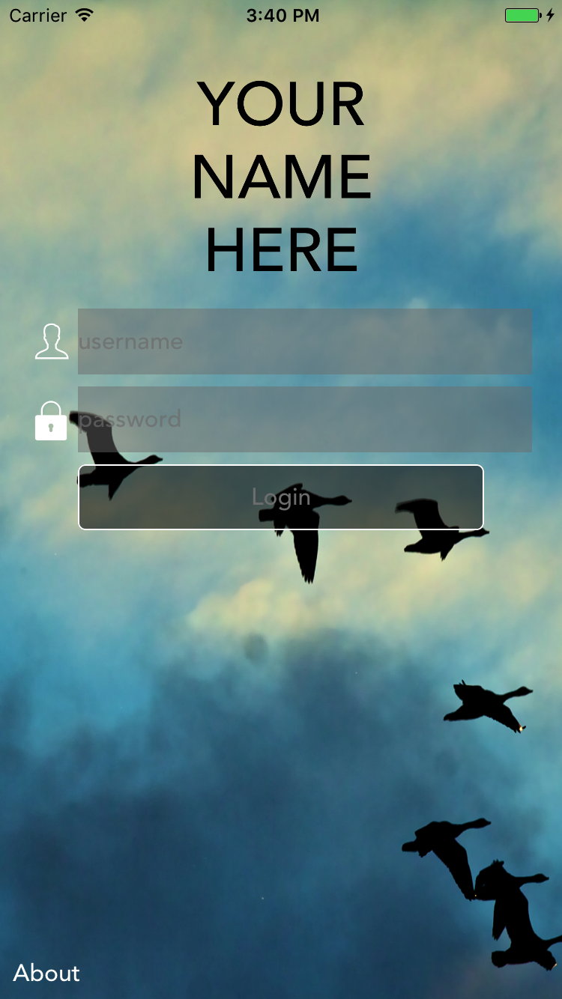
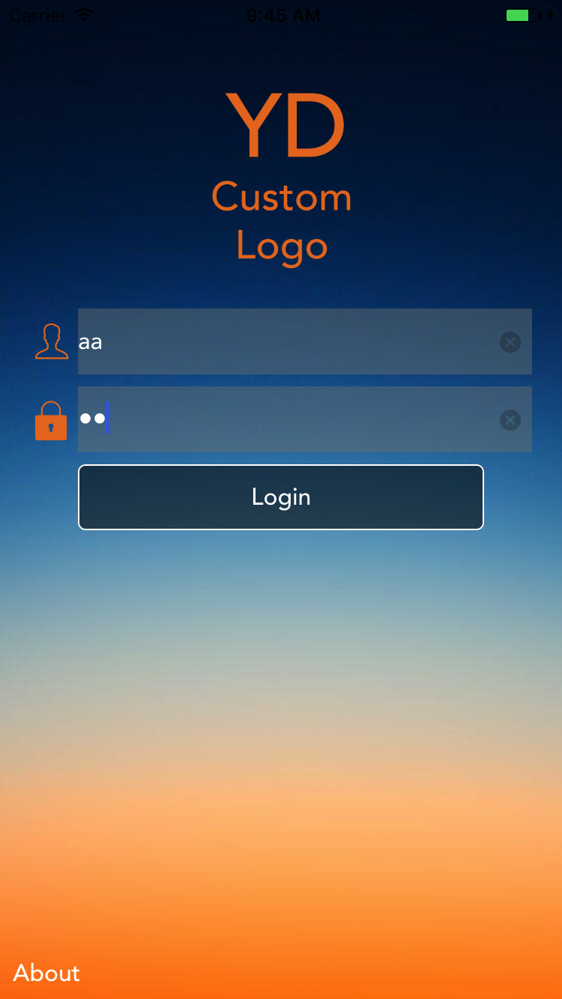

# YDLoginController
A clear and easily customizable Login controller for iOS applications

[](https://swift.org/)
[](LICENSE)



With just a few lines can easily be customized to: 
```swift
// Replace the default background
loginController.style.imgBackground = #imageLiteral(resourceName: "CustomBackground")
		
// Replace the default logo
loginController.style.imgLogo = #imageLiteral(resourceName: "CustomLogo")
		
// Set the user/password icon tint to orange
loginController.style.colorIconTint = UIColor.init(red: 234/255, green: 120/255, blue: 37/255, alpha: 1)
``` 

